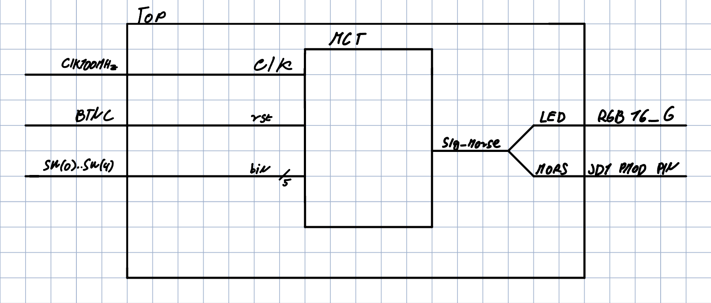
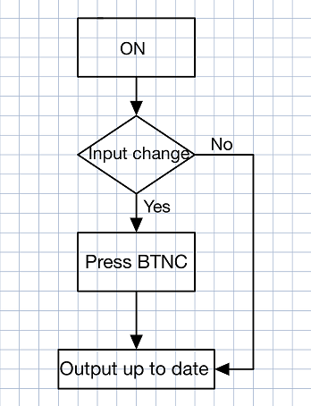
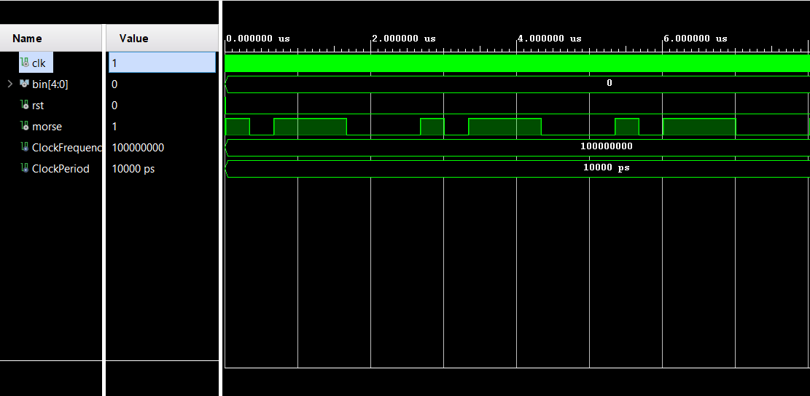
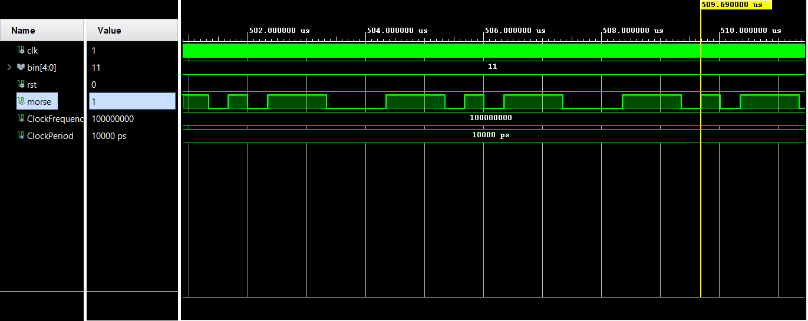
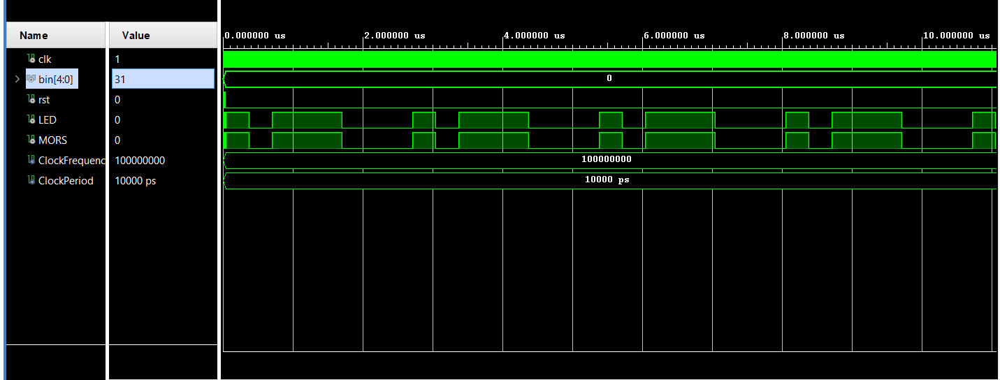
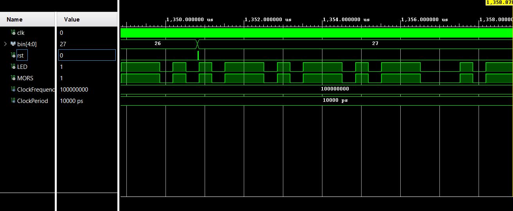
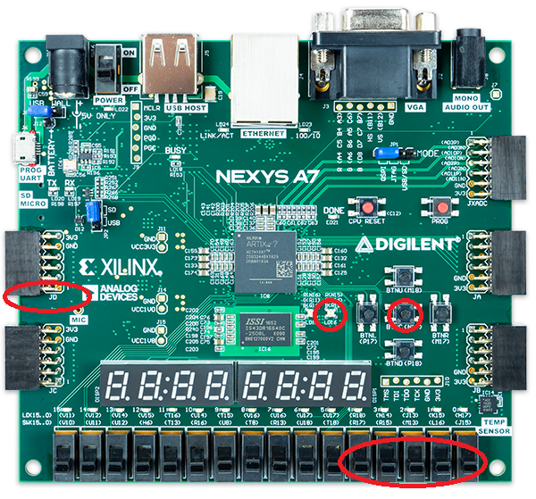

# Morse Code Transmitter
### Team members & responsibilities 
Daniel Graf,Lukáš Lipenský - top, mct, tb, qa

### Theoretical description and explanation
Morse code is a worldwide form of communication where letters, numbers or other characters are represented by a sequence of symbols, dots and dashes. First what we had to come up with was the idea how to input the characters, which in our case was pretty easy as we simply used 5 switches which represent our 5-bit value of letter (see the chart below). After that we needed to figure out how to represent such sequences with signals, for that we chose to go with timings. As it is globally known, dot shall be represented by 1 cycle, dash by 3 cycles. Knowing that we had made all possible sequences and needed to figure out how to output the sequences(signals). We chose to output the morse code sequence in a visual form as a blinking LED and in a signal form through pmod pin.

### Hardware description of demo application
User input is done by selecting binary value of a character on switches `SW(0-4)` and confirmed by pressing select/reset `BTNC` button. Output signal splits trough internal signal `sig_morse` to `RGB 16 G` LED and `JD `pin.

MCT schematic:

### Software description
The core of the program is based all around the 100 MHz clock signal `CLK100MHZ` of the FPGA. We created a variable called ticks which helped us with the timing of each symbol. With each rising edge peak the tick variable increments by 1, by this we can measure the time (or the tick value) and turn on(1) and off(0) the LED/ morse signal.
Lets define term "cycle". One cycle means a period of time where the (tick=clock frequency)/3. Cycles like this are probably the most convenient way how to make simple morse code transmitter. This one cycle is representing dot in our case for example, 3 such cycles represent a dash and the end of a letter is also represented by 3 cycles.

Flowchart:

[Source files](https://github.com/DanielGraf240616/digital-electronics-1/tree/main/MCT_project/mct_de1/mct/mct.srcs/sources_1/new)
[Testbench files](https://github.com/DanielGraf240616/digital-electronics-1/tree/main/MCT_project/mct_de1/mct/mct.srcs/sim_1/new)
### Component(s) simulations
Simulation of the MCT module, letter A represented by **.-**

Simulation of the MCT module, letter K represented by **-.-**

Simulation of the TOP module, letter A representd by **.-**

Simulation of the TOP module, dot representd by **.-.-.-**

### Instructions
The MCT is operated by 5 switches `SW(0-4)` on far right and the middle `BTNC` button.

User inputs desired letter in 5 bit binary form by toggling switches `SW `(up- 1, down- 0) and then confirms by pressing the `BTNC` button which submits the input, after that the RGB led should start blinking depending on the input.  Morse signal is also transmitted by pin 1 of `JD` Pmod port. `BTNC` button also works as a reset button, if user holds the button, the led gets turned off and the pin stops transmitting the morse signal. All buttons/ switches/ pins are located on the fpga as shown on the image below.

Input & output chart
 | **Number** | **Letter** | **Binary input** | **Morse code output** |
 | :-: | :-: | :-: | :-: |
   | 0 | 00000 | A |**. -**|
   | 1 | 00001 | B | **- . . .** |
   | 2 | 00010 | C | **- . - .** |
   | 3 | 00011 | D | **- . .** |
   | 4 | 00100 | E | **.** |
   | 5 | 00101 | F | **. . - .** |
   | 6 | 00110 | G | **- - .** |
   | 7 | 00111 | H | **. . . .** |
   | 8 | 01000 | CH | **- - - -**|
   | 9 | 01001 | I | **. .** |
   | 10 | 01010 | J | **. - - -** |
   | 11 | 01011 | K | **- . -** |
   | 12 | 01100 | L | **. - . .** |
   | 13 | 01101 | M | **- -** |
   | 14 | 01110 | N | **- .** |
   | 15 | 01111 | O | **- - -** |
   | 16 | 10000 | P | **. - - .** |
   | 17 | 10001 | Q | **- - . -** |
   | 18 | 10010 | R | **. - .** |
   | 19 | 10011 | S | **. . .**  |
   | 20 | 10100 | T | **-** |
   | 21 | 10101 | U | **. . -** |
   | 22 | 10110 | V | **. . . -** |
   | 23 | 10111 | W | **. - -** |
   | 24 | 11000 | X | **- . . -** |
   | 25 | 11001 | Y | **- . - -** | 
   | 26 | 11010 | Z | **- - . .** |
   | 27 | 11011 | Tečka | **. - . - . -**|
   | 28 | 11100 | Otažník | **. . - - . .** |
   | 29 | 11101 | Vykřičník | **- - . . . -** |
   | 30 | 11110 | Čárka | **- - . . - -** |
   | 31 | 11111 | Dvojtečka | **- - - . . .**  |
   
   
### References
https://vhdlwhiz.com/ & its YouTube courses
